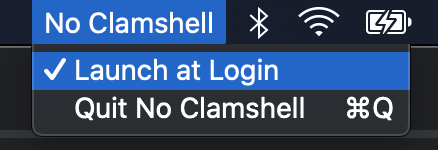

# No Clamshell

No Clamshell is a macOS status bar app to disable the clamshell mode. It does so by putting the machine to sleep when the builtin display is disconnected (covering closed lid situation)

## Feature

No Clamshell supports launch at login. It can be enabled in the No Clamshell menu from the status bar

## Usage

### Installation

- Download the app [here](https://github.com/vinceplusplus/no-clamshell/releases/download/v1.0.0/NoClamshell.app.zip) or from the [releases](https://github.com/vinceplusplus/no-clamshell/releases)

- Unzip it

- Move it to `/Applications`

